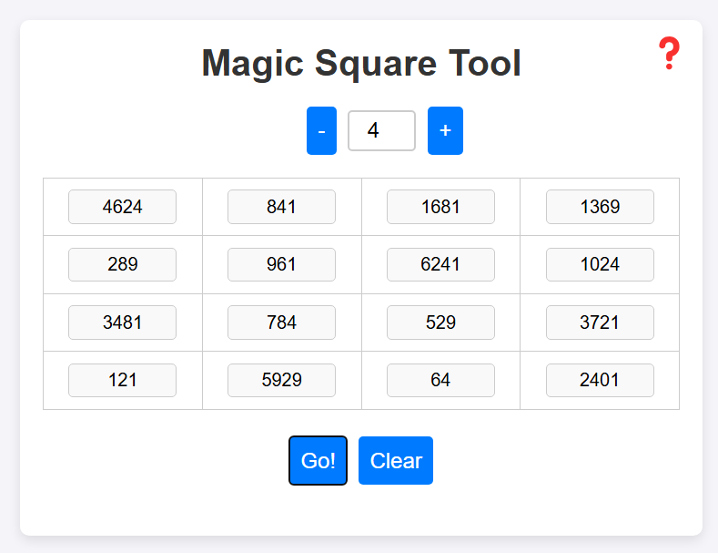

# 🪄 Magic Square Solvers

## Overview

- Some code for solving magic squares in various languages

## Demo

Link: https://mukundks2004.github.io/magic-square-solver/

**Before:**

**After:**

## Comparison

**In C:**
- Very fast
- Minimalistic
- Easy to read, all in one file
- Only uses basic C features (no dynamic memory, pointers, function pointers, typedef, unions, math libraries etc)

**In C#:**
- Good use of data structures
- Strong typing
- Fraction class for no loss of information when dealing with floats

**In js:**
- Copy pasted C code (ugly and lots of unused vars)
- For browser demo